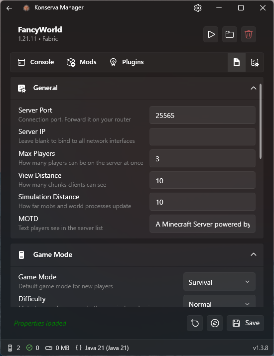
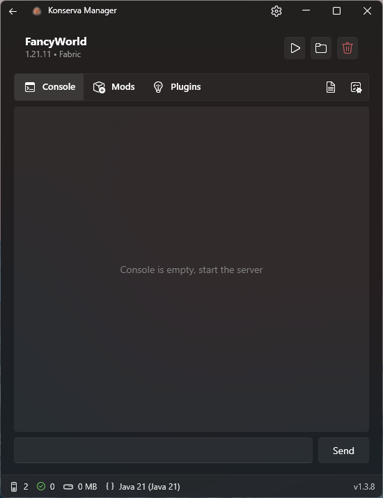
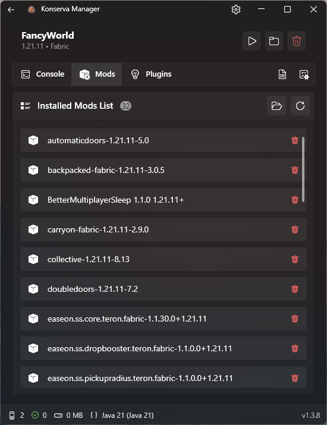

# 🥫 Konserva — Minecraft Server Manager

**Konserva** is a modern GUI tool to create, run, and manage local Minecraft servers on Windows. No command line, no manual config editing — just a clean dashboard.

> Name comes from **con**sole + **serv**er – everything is “canned” and ready to use.

---

## 📸 Screenshots

| Main | Server Properties | Console & Logs | Mods Page |
|----------------|----------------|----------------|----------------|
|  |  |  |  |

---

## ✨ Key Features

- **One-click** server creation (Vanilla, Fabric, Forge, NeoForge, Paper, Purpur)
- **Auto‑install** of any Minecraft version
- **Start / Stop / Restart** with real‑time console
- **GUI editor** for `server.properties`
- **Memory allocation** (min/max RAM) per server
- **Auto‑restart** after crash
- **Mod & plugin viewer** + delete from UI
- **Java version manager** – auto‑detects and picks compatible Java
- **Multiple servers** – different versions running side by side

---

## 🖥️ System Requirements

| Component | Minimum |
|-----------|---------|
| OS | Windows 10 (1903+) / Windows 11 |
| CPU | 1.5 GHz |
| RAM | 2 GB (app) + server RAM |
| Storage | 200 MB (app) |

> For server RAM requirements see [Memory Allocation](#memory-allocation).

---

## 📦 Installation

1. Download latest version from [Releases](../../releases)
2. Unpack archive in any folder
3. Double‑click to run – no installation needed

All data is stored in:  
```txt
Root Folder Konserva\
├── Konserva.exe
├── config.json
├── Servers
│   ├── Server Name\
│   └── servers.json
├── i18n\
│   ├── ru.json
│   └── en.json
└── Logs\
```


---

## 🚀 Quick Start

### Create your first server

1. Launch Konserva
2. Click **`+`** button
3. Fill in:
   - **Name** (e.g., `My Survival`)
   - **Minecraft version** (choose from list)
   - **Modloader** (Vanilla / Fabric / etc.)
   - **Folder** (default is fine)
4. Click **Create** – wait for download (30 sec–2 min)
5. Press ▶ **Start** – wait for `Done (...)!` in console

Your server is now running on port `25565` (default).

---

## ⚙️ Server Configuration

### Memory Allocation

1. Open server page (⚙️ button)
2. Go to **Settings** tab
3. Set **Min RAM** and **Max RAM**
4. Save → restart server

**Typical values**:
- Vanilla → 2–4 GB
- Modded (<50 mods) → 4–6 GB
- Heavy modpacks → 6–8 GB

### Auto‑Restart

Same **Settings** tab → enable **Auto‑Restart** + delay (seconds).

### server.properties Editor

**Properties** tab → edit GUI fields → **Save**

---

## 🧩 Mods & Plugins

### Install Mods (Fabric/Forge/NeoForge)

- Open server → **Mods** tab → click **`mods folder`**
- Copy `.jar` files → refresh list (⟳) → restart server

### Install Plugins (Paper/Purpur)

- Open server → **Plugins** tab → click **`plugins folder`**
- Copy `.jar` files → refresh → restart

### Delete

Find item in list → click **🗑️** → confirm → restart server.

---

## ☕ Java Management

Konserva auto‑detects installed Java and selects the right version for each Minecraft server.

**Manual addition**:
- **Settings** → **Java Management** → **Add Java**
- Point to `java.exe` (e.g., `C:\Program Files\Java\jdk-17\bin\java.exe`)

**Per‑server Java**:
- Server page → **Settings** → **Java** section → choose version → Save

---

## ❓ Common Issues

### Server won't start
- Check console logs
- Verify Java is installed and compatible (Java 21 for 1.20.5+, Java 17 for 1.18–1.20.4)
- Make sure port `25565` is open

### EULA not accepted
- Open `.\Servers\<server_name>\eula.txt`
- Change `eula=false` → `eula=true`
- Restart server

### Out of memory
- Increase **Max RAM** in server settings
- Close other heavy apps

---

## 📄 License & Disclaimer

**MIT License** – see [LICENSE.txt](LICENSE.txt).

> ⚠️ Konserva is an **unofficial tool** – not affiliated with Mojang or Microsoft. Use at your own risk. Always backup your worlds.

---

## 🙏 Credits

- Built with [WPF UI](https://github.com/lepoide/wpfui)
- Assisted by [Qwen Code](https://github.com/QwenLM/qwen-code)

---

🇷🇺 [На русском](README.ru.md)
