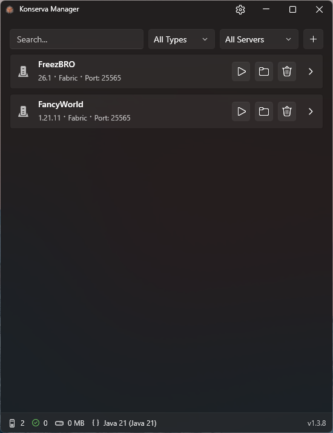

# Konserva

Minecraft Server Manager for Windows

Create, run, and manage local Minecraft servers with a clean GUI. No command line, no manual config editing.

> Name comes from **con**sole + **serv**er — everything is "canned" and ready to use.

[**Download Latest**](../../releases) · [Build Instructions](BUILD.md)

## Features

- One-click server creation — Vanilla, Fabric, Forge, NeoForge, Paper, Purpur
- Auto-install of any Minecraft version
- Start / Stop / Restart with real-time console
- GUI editor for `server.properties`
- Memory allocation (min/max RAM) per server
- Auto-restart after crash
- Mod & plugin viewer with delete support
- **Java version manager**
  - Auto-detects installed Java versions
  - Add Java manually through app Settings
  - Auto-selects compatible version per server
  - Uncheck auto-select to pick a specific version manually
- Multiple servers — different versions running side by side

## Quick Start

1. **Download** from [Releases](../../releases)
2. **Unpack** archive and run `Konserva.exe`
3. **Click +** to create your first server

Your server runs on port `25565` by default.

## Screenshots

More screenshots: [Properties](.github/screenshots/Properties.png) · [Console](.github/screenshots/Console.png) · [Mods](.github/screenshots/Mods.png)

## System Requirements

- **OS:** Windows 10 (1903+) / Windows 11
- **RAM:** 2 GB (app) + server RAM
- **Storage:** 200 MB (app)

For server RAM recommendations, see [Server Requirements](https://minecraft.wiki/w/Server/Requirements) and [Dedicated Servers](https://minecraft.wiki/w/Server/Requirements/Dedicated).

## Troubleshooting

**Server won't start**
- Check console logs
- Verify Java is installed and compatible (Java 25+ for 26.1.x, Java 21 for 1.20.5+, Java 17 for 1.18–1.20.4)
- Ensure port `25565` is free

**EULA not accepted**
- Open `.\Servers\<name>\eula.txt`
- Change `eula=false` → `eula=true`
- Restart server

**Out of memory**
- Increase **Max RAM** in server settings
- Close other heavy applications

## Data Storage

All data (configs, servers, logs, translations) is stored alongside the executable in the same directory.

## License

**MIT License** — see [LICENSE.txt](LICENSE.txt).

> Konserva is an unofficial, community-built tool. It is not affiliated with, endorsed by, or connected to Mojang Studios or Microsoft. Use at your own risk. Always backup your worlds.

## Credits

Built with [WPF UI](https://github.com/lepoide/wpfui) · Assisted by [Qwen Code](https://github.com/QwenLM/qwen-code)

[На русском](README.ru.md)
