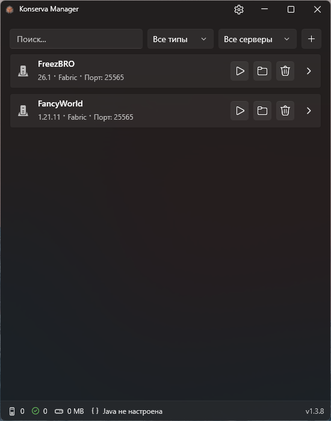
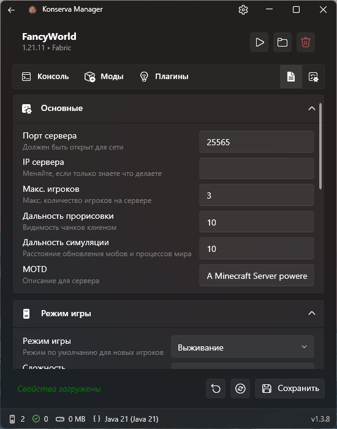
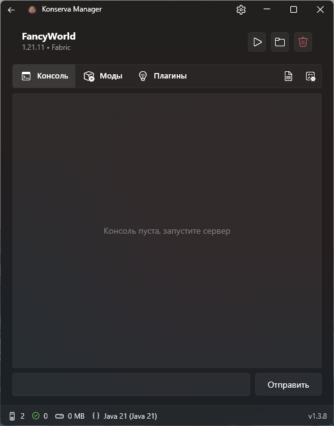
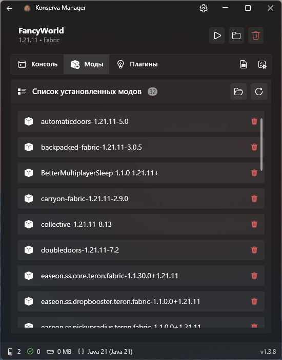

# 🥫 Konserva — Minecraft Server Manager

**Konserva** — это современная программа с графическим интерфейсом для создания, запуска и управления локальными серверами Minecraft на Windows. Никакой командной строки и ручного редактирования конфигов — только понятная панель управления.

> Название образовано от **con**sole + **serv**er — всё «законсервировано» и готово к использованию.

---

## 📸 Скриншоты

| Главное окно | Настройки сервера | Консоль и логи | Страница модов |
|--------------|-------------------|----------------|----------------|
|  |  |  |  |

---

## ✨ Основные возможности

- **Создание сервера в один клик** (Vanilla, Fabric, Forge, NeoForge, Paper, Purpur)
- **Авто-установка** любой версии Minecraft
- **Запуск / Остановка / Перезапуск** с реальной консолью
- **Графический редактор** `server.properties`
- **Настройка памяти** (Мин./Макс. RAM) для каждого сервера
- **Авто-перезапуск** после падения
- **Просмотр модов и плагинов** + удаление из интерфейса
- **Менеджер Java** – автоматически определяет и выбирает совместимую версию
- **Несколько серверов** – разные версии работают одновременно

---

## 🖥️ Системные требования

| Компонент | Минимальные |
|-----------|-------------|
| ОС | Windows 10 (1903+) / Windows 11 |
| Процессор | 1.5 ГГц |
| ОЗУ | 2 ГБ (для программы) + ОЗУ для сервера |
| Диск | 200 МБ (для программы) |

> Требования к ОЗУ для сервера см. в разделе [Настройка памяти](#настройка-памяти).

---

## 📦 Установка

1. Скачайте последнюю версию из [Releases](../../releases)
2. Распакуйте архив в любую папку
3. Запустите двойным щелчком – установка не требуется

Все данные хранятся в:
```
Корневая папка Konserva
├── config.json
├── servers.json
├── Servers
└── Logs\
```


---

## 🚀 Быстрый старт

### Создайте первый сервер

1. Запустите Konserva
2. Нажмите кнопку **`+`**
3. Заполните:
   - **Имя** (например, `Мой выживание`)
   - **Версия Minecraft** (выберите из списка)
   - **Загрузчик модов** (Vanilla / Fabric / и т.д.)
   - **Папка** (можно оставить по умолчанию)
4. Нажмите **Создать** – подождите загрузки (30 сек–2 мин)
5. Нажмите ▶ **Запустить** – дождитесь сообщения `Done (...)!` в консоли

Ваш сервер запущен на порту `25565` (по умолчанию).

---

## ⚙️ Настройка сервера

### Настройка памяти

1. Откройте страницу сервера (кнопка ⚙️)
2. Перейдите на вкладку **Настройки**
3. Установите **Мин. RAM** и **Макс. RAM**
4. Сохраните → перезапустите сервер

**Типичные значения**:
- Vanilla → 2–4 ГБ
- С модами (<50 модов) → 4–6 ГБ
- Тяжёлые сборки → 6–8 ГБ

### Авто-перезапуск

Та же вкладка **Настройки** → включите **Авто-перезапуск** + задержка (секунды).

### Редактор server.properties

Вкладка **Properties** → редактируйте поля в графическом виде → **Сохранить**

---

## 🧩 Моды и плагины

### Установка

- Откройте страницу сервера → вкладка **Моды** или **Плагины** → нажмите на 📁
- Скопируйте `.jar` файлы в папку → обновите список (⟳) → перезапустите сервер

### Удаление

Найдите элемент в списке → нажмите **🗑️** → подтвердите → перезапустите сервер.

---

## ☕ Управление Java

Konserva автоматически определяет установленные Java и выбирает подходящую версию для каждого сервера Minecraft.

**Добавление вручную**:
- **Настройки** → **Управление Java** → **Добавить Java**
- Укажите путь к `java.exe` (например, `C:\Program Files\Java\jdk-17\bin\java.exe`)

**Java для конкретного сервера**:
- Страница сервера → **Настройки** → раздел **Java** → выберите версию → **Сохранить**

---

## ❓ Частые проблемы

### Сервер не запускается
- Проверьте логи в консоли
- Убедитесь, что Java установлена и совместима (Java 21 для 1.20.5+, Java 17 для 1.18–1.20.4)
- Убедитесь, что порт `25565` открыт

### Ошибка "EULA not accepted"
- Откройте `.\Servers\<имя_сервера>\eula.txt`
- Измените `eula=false` → `eula=true`
- Перезапустите сервер

### Не хватает памяти
- Увеличьте **Макс. RAM** в настройках сервера
- Закройте другие тяжёлые приложения

---

## 📄 Лицензия и отказ от ответственности

**Лицензия MIT** – см. файл [LICENSE.txt](LICENSE.txt).

> ⚠️ Konserva — **неофициальный инструмент**, не связан с Mojang или Microsoft. Используйте на свой страх и риск. Всегда делайте резервные копии миров.

---

## 🙏 Благодарности

- Пакету [WPF UI](https://github.com/lepoide/wpfui)
- ИИ [Qwen Code](https://github.com/QwenLM/qwen-code)

---

🇬🇧 [English version](README.md)
